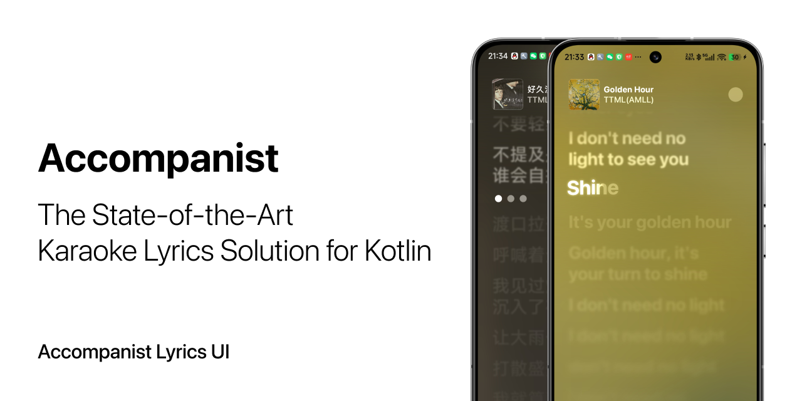

[](https://github.com/6xingyv/accompanist-lyrics-phonetics/actions/workflows/ci.yml)
[](https://central.sonatype.com/artifact/com.mocharealm.accompanist/lyrics-phonetics-runtime)
[](https://t.me/mocha_pot)
[](https://www.apache.org/licenses/LICENSE-2.0.txt)

## 📦 Repository

Accompanist includes a group of libraries:

- [`lyrics-core`](https://github.com/6xingyv/accompanist-lyrics-core) — Parse lyrics files, retain timing and metadata, and export to other formats.
- [`lyrics-ui`](https://github.com/6xingyv/accompanist-lyrics-ui) — Display synchronized lyrics with Compose Multiplatform.
- `lyrics-phonetics` — Resolve pronunciation on device and format captions for lyrics.

This repository hosts the `lyrics-phonetics` code, a Kotlin Multiplatform library for Android, JVM and iOS.

## ✨ Features

- **🌏 Multilingual Readings**: Mainland and Taiwan Mandarin, Hong Kong Cantonese, and Japanese.
- **🧠 Contextual Pronunciation**: Language hints, alternative readings and custom overrides.
- **🎤 Lyrics Alignment**: Project pronunciation onto original lyric ranges.
- **📱 Offline & Multiplatform**: Optional data packs for Android, JVM and iOS.

## 🚀 Installation

Add the runtime and the data packs you need to your `build.gradle.kts`:

```kotlin
dependencies {
    implementation("com.mocharealm.accompanist:lyrics-phonetics-runtime:0.1.0")
    implementation("com.mocharealm.accompanist:lyrics-phonetics-data-mandarin:0.1.0")
    implementation("com.mocharealm.accompanist:lyrics-phonetics-data-cantonese:0.1.0")
    implementation("com.mocharealm.accompanist:lyrics-phonetics-data-japanese:0.1.0")
}
```

For Kotlin Multiplatform, add these to `commonMain.dependencies`. Include only the language packs you need.

On Android, keep dictionary assets uncompressed so the loader can map them:

```kotlin
android {
    androidResources { noCompress += "lpd" }
}
```

On iOS, copy the data packs and their licenses from the `resources` ZIP into the app bundle.

## ▶️ Usage

```kotlin
import com.mocharealm.accompanist.lyrics.phonetics.*
import com.mocharealm.accompanist.lyrics.phonetics.data.*

// JVM example. On Android use AndroidPackLoader(context);
// on iOS use IosBundlePackLoader().
val loader = SharedPackLoader(ClasspathPackLoader())
val engine = PhoneticEngine(listOf(
    MandarinData.mainland(loader),
    MandarinData.taiwan(loader),
    CantoneseData.hongKong(loader),
    JapaneseData.japanese(loader),
))
val result = engine.parse(
    "银行行走",
    ParseOptions(defaultLocale = ReadingLocale.MANDARIN_CN),
)

println(AsciiFormatter().format(result).latin) // yin hang xing zou
println(AsciiFormatter(FormatOptions(tones = ToneStyle.NUMBERS)).format(result).latin)
// yin2 hang2 xing2 zou3
```

## 🛠️ Documentation

- [Dictionary format](docs/FORMAT.md)
- [Data sources and licenses](docs/DATA.md)
- [Benchmarks](benchmark/README.md)

## 🤝 Contributing

Contributions are welcome! Please open an issue before proposing major changes.

## 📜 License

Code is licensed under **Apache License 2.0**. See [LICENSE](LICENSE). Language data has separate licenses; see [data sources and licenses](docs/DATA.md) and retain the bundled notices.
